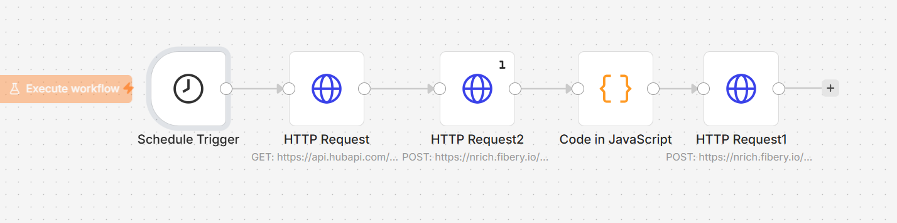

# 🔄 HubSpot Social Media Broadcasts to Fibery CRM/Workspace Sync

### 🎯 Overview
In modern Revenue Operations (RevOps), tracking marketing activities alongside operational data is vital for attribution and performance analysis. This automated data pipeline runs on a scheduled interval to extract published and scheduled social media broadcasts from **HubSpot CRM**, cross-references them with existing records in **Fibery** (Project Management Workspace), and performs bulkupserts (intelligent create or update actions) to ensure both systems are fully aligned.

### 🧠 Technical Highlight: Batch API Processing
Instead of making individual API calls for every single social media post—which causes performance lags and hits API rate limits—this workflow features a high-performance **JavaScript custom code node**. It compiles hundreds of records into a single batched payload array (`fibery.entity/create` or `fibery.entity/update`), executing a massive bulk sync in one single network request.

### 🔄 Data Flow Architecture
1. **Trigger:** A Schedule Trigger executes the automation workflow every 6 hours.
2. **Fetch Source Data:** Requests social media broadcast history from HubSpot API (`since 2026`).
3. **Fetch Destination State:** Queries Fibery to extract currently mapped HubSpot IDs.
4. **Data Transformation & Reconciliation (JS):** - Maps statuses dynamically (`WAITING`, `SUCCESS`, `CANCELED`).
   - Normalizes titles, publishing dates, media URLs, and network channels (LinkedIn, Facebook, Twitter).
   - Segregates data into `Update` or `Create` command batches based on ID existence.
5. **Bulk Load:** Sends the stringified array commands to Fibery’s high-speed endpoint.

### 🛠️ Tools & Nodes Used
* **Schedule Trigger Node:** Set to trigger automatically every 6 hours.
* **JavaScript Code Node:** Advanced programmatic data manipulation and bulk payload aggregation.
* **HTTP Request Nodes:** Rest API integrations using custom Bearer Authorization headers for HubSpot and Fibery.

### 📸 Workflow Canvas

### 🚀 How to Replicate
1. Download the `workflow.json` from this directory.
2. Import it into your n8n canvas.
3. Replace `[YOUR_HUBSPOT_TOKEN]` and `[YOUR_FIBERY_TOKEN]` with your workspace access tokens.
