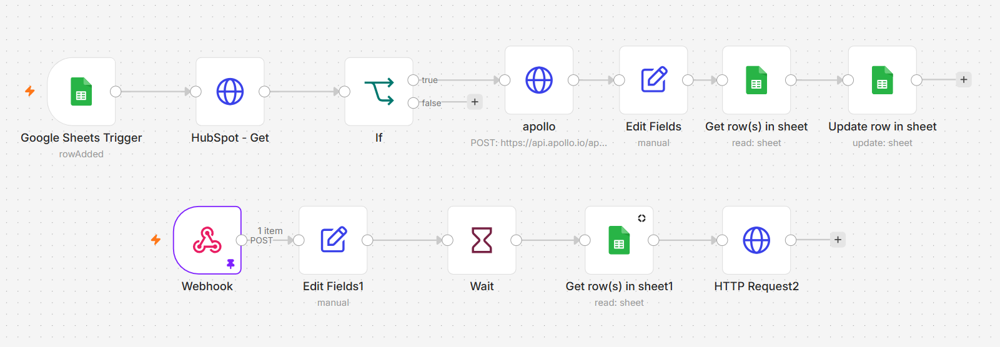

# 📞 Asynchronous Waterfall Contact Enrichment Pipeline (HubSpot & Apollo.io)

### 🎯 Overview
Manually tracking down missing direct-dial phone numbers for inbound leads slows down sales velocity. This enterprise-grade production workflow establishes an **Asynchronous Waterfall Data Enrichment Pipeline** that automatically checks incoming HubSpot contacts, identifies missing data, and triggers a background lookup via Apollo.io's API. 

Because contact data matching can take time, the workflow utilizes a high-level **Asynchronous Webhook Pattern**. Instead of hanging the execution and consuming server memory, it registers a callback webhook with Apollo, stores the transaction states inside a Google Sheets layer, and completes the execution cycle gracefully when Apollo fires the data back.

### 🔄 Distributed Architecture Flow
1. **Inbound Trigger:** Google Sheets captures new contact IDs routed from internal forms or operational pipelines.
2. **CRM Condition Check:** The workflow polls HubSpot CRM to extract existing contact data and applies an `If Conditional Evaluation` to verify if the `phone` property is blank.
3. **Async Triggering:** If blank, it registers a programmatic execution call to Apollo's `people/match` API, providing a secure n8n instance callback URL and logging the temporary `apollo_request_id` back to the lookup sheet.
4. **Webhook Callback Processing:** Upon data location, Apollo executes a `POST` request to the secondary Webhook entrance node.
5. **State Reconciliation & Hydration:** A state lookup pulls the matching row from Google Sheets using the reference key, validates the identity payload, and runs a granular `PATCH` request to push the newly enriched phone number straight into HubSpot CRM.

### 🛠️ Tools & Nodes Used
* **HubSpot REST API:** Clean retrieval and field-level updates (`PATCH`) on active contact records.
* **Apollo.io Match API:** Data broker connectivity using background direct-dial lookup functions.
* **n8n Webhook Target Gateway:** Highly responsive programmatic receiver handling asynchronous cross-platform payloads.
* **Google Sheets Sync Layer:** Used as a lightweight relational transaction log to tie async callbacks to original execution loops.

### 📸 Workflow Canvas

### 🚀 How to Replicate
1. Download the clean `workflow.json` from this directory.
2. Import the json directly to your n8n workspace canvas.
3. Replace the `webhook_url` inside the Apollo HTTP configuration to target your production n8n environment.
4. Add your standard HubSpot Private App API Key and Apollo API token parameters inside your credentials panel.
