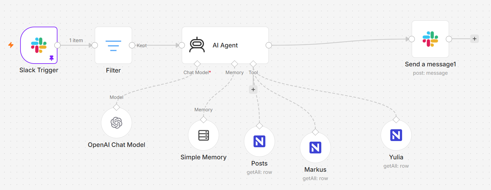

# 💬 LinkedIn Slack Engagement Analytics AI Agent

### 🎯 Overview
In modern B2B marketing and social selling strategies, monitoring how prospects engage with team members' LinkedIn content is critical for timely sales outreach. However, navigating multiple LinkedIn profiles or shifting through raw database rows manually causes delay and friction for sales teams.

This workflow builds an intelligent, context-aware **AI Assistant inside Slack** that allows sales and marketing teams to query real-time LinkedIn engagement data using natural language. Powered by an advanced LLM and equipped with specialized database routing tools, the agent acts as an automated analyst—instantly fetching metrics on team posts, individual engager profiles, and Ideal Customer Profile (ICP) alignment directly inside a Slack thread.

### 🧠 System Architecture & Capabilities
1. **Event-Driven Slack Monitoring:** Utilizing a Slack Trigger node, the workflow actively listens for direct `@mentions` or messages inside a dedicated tracking channel (`#test-linkedin-monitoring`).
2. **Automated Loopback & Bot Filter:** A custom filter node evaluates metadata attributes to instantly discard automated messages or bot responses, preserving execution credits.
3. **Autonomous RAG (Retrieval-Augmented Generation):** Integrates an n8n LangChain AI Agent wrapper that converts loose, unstructured natural language questions (e.g., *"Who interacted with Markus's last post?"*) into definitive database query strategies.
4. **Dynamic Database Routing Tools:** The AI agent is natively armed with multiple, isolated **NocoDB Tool nodes** that function as programmatic lookup functions:
   * **Posts Table:** Retrieves global metrics like likes, comments, shares, and timestamps across all team members.
   * **Individual Engager Tables (Markus, Yulia, etc.):** Targets granular profiles containing job titles, companies, live LinkedIn URLs, and specific ICP classifications (Tier 1, Tier 2, Tier 3, Not ICP).
5. **Threaded Context Preservation:** A Memory Buffer Window node maintains continuous chat history mapped to individual Slack channel sessions. The final Slack block safely resolves execution payloads and formats responses back into the active Slack message thread.

### 🛠️ Tools & Nodes Used
* **Slack Trigger & Slack Node:** Real-time event subscription and target message response threading.
* **n8n LangChain Agent Wrapper:** Task routing, autonomous planning, and context matching.
* **OpenAI Chat Model (`gpt-4o-mini` / Extended):** Processes data summaries and formats answers cleanly for Slack layouts using bullet points.
* **NocoDB Tool Nodes:** Functions as decentralized database connectors exposing structured schemas directly to the LLM agent.
* **Memory Buffer Window Node:** Maintains a strict session-key structure using custom Slack channel IDs to support multi-user chat sessions.

### 📸 Workflow Canvas

### 🚀 How to Replicate
1. Download the `workflow.json` from this repository folder.
2. Import it into your n8n workspace.
3. Create your NocoDB tables (`Posts`, `[Name] Engagers`) mapping out target user profiles.
4. Connect your Slack App Bot Token and OpenAI API Key inside the n8n credentials panel.
