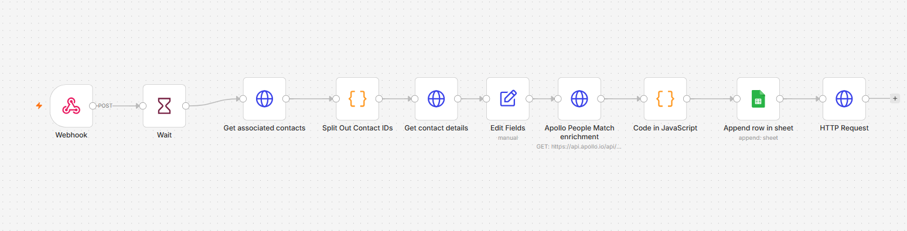

# 🚀 Automated HubSpot Lead-Contact Enrichment Engine (Apollo API & Google Sheets)

### 🎯 Overview
In modern B2B RevOps pipeline design, inbound leads often enter the CRM with sparse or unverified structural data. Waiting for sales reps to manually research contact hierarchies, social handles, and structural role mappings slows down speed-to-lead velocity.

This workflow automates enterprise-level **inbound contact enrichment**. Triggered instantly by a HubSpot Lead creation webhook, it traces underlying object graph links to extract associated contact IDs. It queries HubSpot for foundational identity markers, pushes those nodes into the **Apollo People Match API** for cross-database enrichment, normalizes the complete profile payload using JavaScript, and logs the data into a central tracking **Google Sheet** while synchronously updating the primary HubSpot Contact record.

### 🧠 System Architecture & Data Pipeline Flow
1. **Inbound Webhook Capture:** Listens to real-time events triggered upon HubSpot Lead object insertions.
2. **Graph Link Resolution:** Hits HubSpot’s `/crm/v4/objects/leads/{id}/associations/contacts` graph network to dynamically isolate all underlying matching contact nodes linked to the lead container.
3. **Asynchronous Property Lookup:** Extracts core identity primitives (`firstname`, `lastname`, `email`, `hs_email_domain`) for every single mapped contact record sequentially.
4. **Apollo Identity Resolution:** Pushes identity data points into the Apollo `/v1/people/match` target endpoint. It queries corporate email networks and firmographic match structures to retrieve missing context (e.g., Seniority, Department hierarchies, validated LinkedIn profiles, and global addresses).
5. **Algorithmic Field Normalization:** Runs custom JavaScript logic ("Code in JavaScript") to handle fallback logic. If Apollo cannot supply an enriched field, it dynamically retains the historical HubSpot CRM values while cleanly formatting comma-separated string arrays for `departments`, `subdepartments`, and `functions`.
6. **Bidirectional Writeback Sync:** * **Audit Logging:** Appends the complete normalized contact footprint into an external analytical tracking Google Sheet (`Sales Leads enrichment [Automation]`) utilizing unique constraints.
   * **CRM Standardization:** Fires an internal REST `PATCH` update directly to HubSpot, overwriting unverified baseline attributes with certified Apollo properties (`linkedin_url`, `jobtitle`, `seniority`, `state`) in real-time.

### 🛠️ Tools & Nodes Used
* **HubSpot REST Connectors:** Mapped natively via custom endpoint loops for v4 Relationship Associations and v3 Object Mutation queries.
* **Apollo People Match API Engine:** Executes real-time identity graphing and firmographic indexing.
* **Google Sheets Node (v4.7):** Configured for structured append patterns with active validation matching keys (`Lead ID`).
* **Advanced JavaScript Engineering:** Drives programmatic array mapping, empty parameter sanitization, and fallback orchestration.

### 📸 Workflow Canvas

### 🚀 How to Replicate
1. Download the `workflow.json` file inside this repository folder.
2. Import the JSON architecture directly into your local or cloud n8n canvas.
3. Configure your HubSpot Private App Token inside the HTTP Request headers.
4. Attach your verified Apollo `X-Api-Key` token inside the matching engine headers.
5. Connect your Google Sheets OAuth credentials and supply your target Master Sheet ID.
