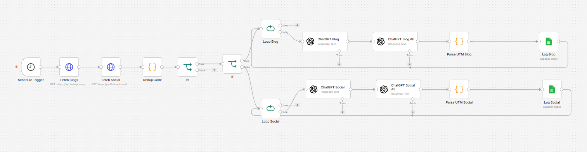

# 🤖 Multi-Channel AI Content Distribution Engine (GPT-5 & Automated UTM Parsing)

### 🎯 Overview
In modern marketing operations, creating a core piece of content (like a comprehensive long-form article) is only 20% of the battle. The remaining 80% relies on efficient content distribution across multiple channels (Websites, Blogs, LinkedIn, Twitter, etc.). Manually rewriting content for different formats and manually appending tracking links is a tedious, error-prone bottleneck.

This workflow automates the entire distribution lifecycle. Triggered by a content injection pipeline, it intelligently routes data using conditional logic. It harnesses advanced LLMs (**GPT-5-Mini** / OpenAI integrations) to repurpose core assets into highly tailored long-form blogs or optimized social media copy, extracts and structuralizes automated UTM tracking parameters via JavaScript, loops over active arrays to scale distributions, and logs outputs for systemic publishing.

### 🧠 System Architecture & Operational Pipeline
1. **Intelligent Routing Canvas:** Inbound content properties hit a structural routing filter (`If Node`) that instantly classifies incoming payloads by their distribution intent (e.g., strictly `blog` vs. alternative channels).
2. **Advanced AI Transformation Layer:** * **Blog Variant Strategy:** Diverts data to targeted LLM prompt parameters (`ChatGPT Blog` powered by `gpt-5-mini`) to format web-ready, SEO-friendly structured HTML/Markdown articles.
   * **Social Snippet Strategy:** Routes content to specialized prompts (`ChatGPT Social`) tasked with generating high-engagement snippets embedded with organic formatting, line breaks, and professional styling.
3. **Automated Tracking Analytics (UTM Parsing):** Instead of leaving campaign tracking to human intuition, consecutive JavaScript nodes (`Parse UTM Blog` and `Parse UTM Social`) programmatically extract, validate, and append explicit tracking tags (`utm_source`, `utm_medium`, `utm_campaign`) dynamically mapped to each output asset.
4. **Iterative Batch Array Execution:** Utilizing localized execution tokens (`Loop Blog` and `Loop Social`), the engine loops through target distributions, pushing independent platform variations to production logs without overloading memory stacks.

### 🛠️ Tools & Nodes Used
* **OpenAI Advanced Matrix:** Configured with state-of-the-art model parameters (`gpt-5-mini`) for contextual brand alignment and localized content variations.
* **Conditional Switch/If Nodes:** Orchestrates conditional paths based on strict variable matching.
* **Advanced Array Loops:** Iteratively cycles batch objects (`Loop Over Items` frameworks) for programmatic delivery control.
* **JavaScript Analytics Nodes:** Sanitizes string text, creates fallback logic for tracking parameters, and outputs clean analytics structures.

### 📸 Workflow Canvas

### 🚀 How to Replicate
1. Download the `workflow.json` file from this directory.
2. Import the JSON payload directly into your active n8n automation canvas.
3. Establish your OpenAI OAuth API keys and connect them to the LLM completion models.
4. Adjust the prompt strategies inside `ChatGPT Blog` and `ChatGPT Social` nodes to perfectly mirror your organization's specific brand voice and persona guidelines.
