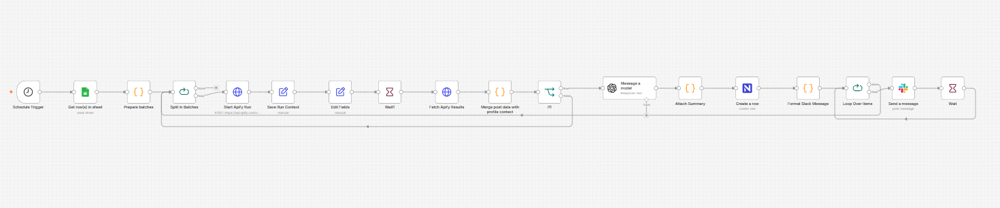

# 📈 Automated ICP Intelligence & Daily Social Scraping Pipeline (Apify, Slack & Google Sheets)

### 🎯 Overview
For high-growth B2B enterprise GTM (Go-To-Market) teams, tracking account-level activity and updates across key Tier 1 and Tier 2 target accounts is critical. Manually browsing hundreds of prospect websites or company portals daily to spot structural changes, press updates, or new business footprints creates a massive operational bottleneck.

This production-grade workflow automates enterprise account intelligence gathering on a strict daily cron cycle. It extracts high-value target accounts from a centralized **ICP Tracking Google Sheet**, splits them into managed execution batches, programmatically triggers asynchronous **Apify Scraping Actors** to harvest digital data footprints, logs the formatted intelligence into an internal warehouse database, and dispatches real-time structured insight summaries directly to the Go-To-Market team via **Slack**.

### 🧠 System Architecture & Workflow Mechanics
1. **Daily Cron Synchronization:** Triggered automatically every day at a specific target hour (`19:15` or 7:15 PM) via an integrated `Schedule Trigger` node to prepare accounts before the next active sales day.
2. **Master ICP Ingestion:** Pulls a dynamic row list of qualified Tier 1 and Tier 2 accounts directly from a structured repository spreadsheet named `ICP Tier1-2 post scraping`.
3. **Controlled Batch Processing:** To avoid hitting external service rate limits, the data runs through an iterative `Split In Batches` engine, chunking target sites into safe parallel processing sequences.
4. **Asynchronous Scraping Framework:** Programmatically executes an HTTP request to dispatch high-performance scraping jobs on **Apify**. The workflow utilizes a built-in `Wait Node` to hold execution for a designated interval, allowing Apify's headless cloud engine to crawl the target URLs without causing an active timeout.
5. **Data Harmonization & Central Logging:** Fetches the completed scraping payload, structures missing values via JavaScript formatting matrices, and appends the fresh account intelligence cleanly into a historical master spreadsheet.
6. **Instant GTM Slack Alerts:** Runs an internal string-templating block (`Format Slack Message`) to construct a highly visible, styled Markdown notify snippet and shoots it out instantly to dedicated Slack sales pipelines.

### 🛠️ Tools & Nodes Used
* **Schedule Trigger & Split In Batches Nodes:** Drives the systematic orchestration intervals and scales large datasets safely without instance memory leaks.
* **Apify REST API Connector (HTTP Request):** Invokes cloud-hosted crawling agents asynchronously.
* **Google Sheets Integration Nodes (v4):** Acts as the centralized target registry input and execution log database output.
* **Slack Integration Node:** Standardizes internal communication flows by dispatching markdown-rich notification matrices.

### 📸 Workflow Canvas

### 🚀 How to Replicate
1. Download the `workflow.json` file in this directory.
2. Import it directly into your local or enterprise cloud-hosted n8n environment.
3. Configure your Google Workspace OAuth credentials to target your specific ICP Master Spreadsheet.
4. Set your Apify API Token inside the API connection headers.
5. Setup a Slack App Webhook or Bot Token and map your sales notification channel.
