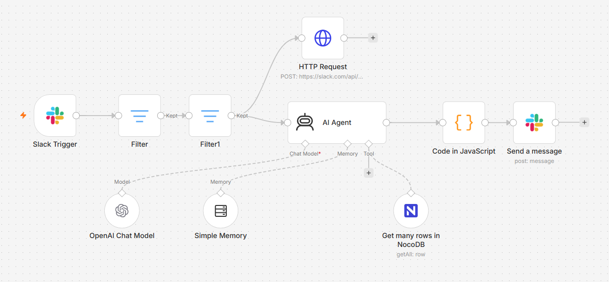

# 🤖 AI-Powered ICP Slack Agent & Social Intent Analyzer (n8n Advanced AI & OpenAI)

### 🎯 Overview
In modern B2B Go-To-Market (GTM) frameworks, capturing buying intent from social posts or community messages created by your Ideal Customer Profile (ICP) personas is key to outcompeting the market. However, manually reading every pulled social feed, identifying whether a post indicates a genuine business pain point, and determining how a sales rep should react requires massive cognitive effort and causes critical delays.

This production-grade workflow builds an autonomous **Social Intent AI Agent** embedded directly into your corporate communication layer. Triggered instantly by new messages or scraped posts pushed into **Slack**, it filters out noise and routes high-value signals to an **Advanced n8n AI Agent Node**. Powered by OpenAI, this agent executes deep semantic analysis against strict enterprise boundaries, evaluates context, and pushes structured GTM insights straight back to your sales teams natively inside Slack.

### 🧠 System Architecture & Workflow Mechanics
1. **Real-Time Social Stream Ingestion:** A specialized `Slack Trigger` ("Slack Content Monitor Bot") listens to target channels receiving incoming streams of raw social media scraping payloads or buyer community texts.
2. **Multi-Stage Operational Filtering:** Before hitting expensive LLM token limits, incoming payloads flow through sequential routing rules (`Filter` and `Filter1`) to isolate empty values, sanitize format distributions, and verify structural authenticity.
3. **Autonomous Reasoning Framework (AI Agent Node):** Qualified items feed into an advanced n8n `AI Agent` structure wrapped with strict deterministic boundaries.
   * **System Persona Enforcement:** The model is bound by a foundational directive: *"Assist in analyzing data of posts created by ICP personas. Ensure a high level of accuracy and base answers strictly on verified available records."*
   * **Cognitive Engine:** Utilizes an `OpenAI Chat Model` connector linked with high-performance completion properties.
4. **Context-Aware Response Generation:** The AI agent synthesizes the underlying buyer pain points, identifies targeted value propositions, and passes a clean payload to a processing JavaScript layer.
5. **Direct GTM Actionable Output:** Fires a programmatic Slack block update (`Send a message`) to reply instantly in-thread or dispatch styled notifications mapping target opportunities for Sales Development Representatives (SDRs).

### 🛠️ Tools & Nodes Used
* **Advanced n8n AI Framework:** Harnesses the specialized **AI Agent** structural node configured with localized system instructions.
* **OpenAI Chat Model Connector:** Drives deep contextual intelligence, conversational reasoning, and unstructured text analytics.
* **Slack Trigger & App Connectors:** Establishes bidirectional pipeline communication, capturing incoming events and publishing high-styled markdown summaries.
* **JavaScript Field Normalization:** Formats internal payload tokens and isolates structural string arrays seamlessly.

### 📸 Workflow Canvas

### 🚀 How to Replicate
1. Download the `workflow.json` file inside this repository folder.
2. Import the JSON payload into your active n8n instance canvas.
3. Connect your Slack App and ensure your Bot token has permission to read channel histories and post messages (`chat:write`).
4. Establish your OpenAI OAuth API credential parameters to fuel the primary AI Agent memory blocks.
5. Fine-tune the embedded System Message prompt to map specific buying triggers unique to your product line.
