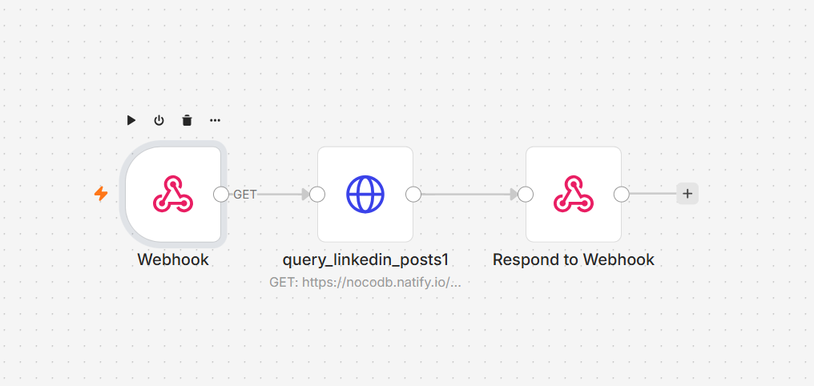

# 📡 Custom AI Data Endpoint: ICP LinkedIn Posts Query API (NocoDB)

### 🎯 Overview
For AI Agents to truly perform contextual analysis, they need real-time access to accurate prospect data. Standard Model Context Protocol (MCP) servers can sometimes be restrictive or overkill for simple database queries. 

This workflow provides a lightweight, highly responsive **Custom API Endpoint** using n8n Webhooks. It is designed to act as a data-fetching tool for external AI agents or Go-To-Market (GTM) platforms. Upon receiving a search request payload (like a keyword or contact tier), it securely queries an internal **NocoDB** warehouse containing scraped LinkedIn posts of Tier 1 and Tier 2 ICPs, and returns a sanitized JSON response back to the requesting agent.

### 🧠 System Architecture & Workflow Mechanics
1. **Webhook Ingestion:** An active POST Webhook waits for incoming queries from external systems or AI agents requiring prospect LinkedIn data.
2. **Database Querying (NocoDB):** Parses the incoming search parameters (e.g., `where` clauses) and constructs a secure HTTP request to the NocoDB REST API to filter and fetch the exact matching LinkedIn posts.
3. **Synchronous Data Return:** Uses a `Respond to Webhook` node to instantly push the structured JSON payload back to the requester, completing the API call loop smoothly.

### 🛠️ Tools & Nodes Used
* **Webhook Node:** Acts as the entry point and API listener.
* **HTTP Request Node:** Configured to interface with NocoDB using secure `xc-token` headers and dynamic query parameters.
* **Respond to Webhook Node:** Ensures the workflow acts as a true synchronous API, returning the fetched data payload natively.

### 📸 Workflow Canvas

### 🚀 How to Replicate
1. Download the `workflow.json` file inside this folder.
2. Import the JSON payload into your active n8n instance canvas.
3. Replace the `[YOUR_NOCODB_URL]` placeholder with your actual NocoDB target URL.
4. Securely add your NocoDB `xc-token` to the HTTP Request authentication headers.
5. Provide this Webhook URL to your AI Agent or GPT as a custom tool endpoint for querying LinkedIn posts.
